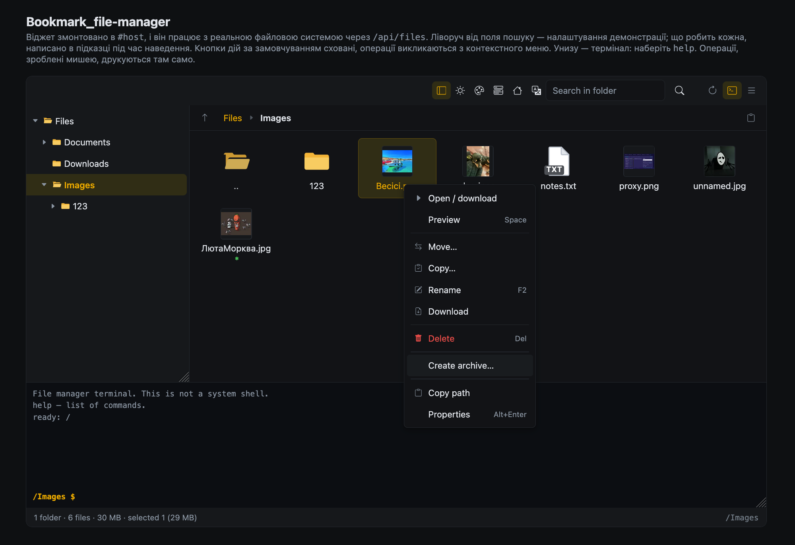

# Bookmark_file-manager

Вбудовуваний файловий менеджер: фронтенд-віджет без залежностей і Express-роутер поверх
реальної файлової системи. Усі вісім операцій панелі — робочі.

- **Віджет** — звичайний JS-клас, монтується в будь-який DOM-елемент. Не тягне за собою
  Bootstrap, jQuery, шрифти іконок і взагалі нічого: нуль runtime-залежностей.
  Збірка — 98 КБ JS + 7 КБ CSS у gzip; з них ~26 КБ — чотири неанглійські мови
  (лише з англійською вийшло б 73 КБ).
- **П’ять мов із коробки** — англійська (типова), українська, іспанська, німецька,
  французька. Своя мова — це об’єкт зі словником.
- **Бекенд** — одна функція `(req, res)` без фреймворка: монтується в Express,
  AdonisJS, Fastify, Nest або голий `node:http`. Власного сервера не піднімає
  і глобального стану не тримає.
- Працює в React / Vue / Angular / Svelte / без фреймворка — це просто DOM.

<!-- Заглушка. Покладіть справжній скриншот замість docs/screenshot.png — ім’я
     згадується тут і в README.md, більше нічого міняти не треба. -->


> 🇬🇧 [This page in English](README.md) — головна версія документації.

---

## Встановлення

```bash
npm install bookmark-file-manager
```

Жодного фреймворка ставити не треба — ні на клієнті, ні на сервері.

---

## Швидкий старт

### Сервер

Одна функція, без фреймворка. Вона має вигляд `(req, res)` — саме те, що приймає
Express як мідлвару і що будь-який Node-фреймворк може віддати зі своїх сирих
об'єктів.

```js
import express from 'express';
import { createFileManagerRouter } from 'bookmark-file-manager/server';

const app = express();

app.use('/api/files', createFileManagerRouter({
  root: './storage',          // єдиний каталог, який видно клієнту
}));

app.listen(3000);
```

Express тут — ваш вибір, а не вимога: [те саме в Adonis, Fastify, Nest або
голому `node:http`](#куди-його-можна-змонтувати).

### Клієнт

```js
import { FileManager } from 'bookmark-file-manager';
import 'bookmark-file-manager/style.css';

const manager = new FileManager('#file-manager', {
  endpoint: '/api/files',
});
```

```html
<div id="file-manager" style="height: 600px"></div>
```

Контейнеру потрібна висота — віджет займає її цілком.

---

## Що вміє

**Вісім основних операцій.** За замовчуванням їхніх кнопок на панелі немає — операції
викликаються з контекстного меню та гарячими клавішами. Повернути кнопки:
`toolbarActions: true` (див. [нижче](#кнопки-на-панелі)).

| Кнопка | Що робить |
| --- | --- |
| Створити теку | Діалог імені, перевірка зайнятості до надсилання на сервер |
| Створити файл | Те саме; розширення визначає значок |
| Перемістити | Вибір теки призначення в дереві; теку не можна перемістити всередину себе |
| Копіювати | Рекурсивно, з автоперейменуванням у разі конфлікту |
| Перейменувати | Рівно для одного вибраного елемента, `F2` |
| Видалити | З підтвердженням і переліком того, що видаляється, `Delete` |
| Завантажити на пристрій | Один файл — потоком; тека або мультивибір — ZIP на льоту |
| Завантажити | Мультизавантаження з поступом і скасуванням; drag & drop |

**Крім цього:**

- Дерево тек із лінивим підвантаженням рівнів
- Мініатюри зображень просто в плитках і перегляд зображень та PDF поверх
  віджета, зі стрілками по файлах теки ([докладніше](#перегляд-і-мініатюри))
- Властивості файлу та зміна прав доступу з контекстного меню
  ([докладніше](#права-доступу-та-властивості))
- Пакування й розпакування 13 форматів архівів ([докладніше](#архіви))
- Пошук по всьому дереву: маски, регулярні вирази, розширення, лише
  файли або лише теки, за вмістом ([докладніше](#пошук))
- Термінал із командами файлового менеджера — ls, cd, cat, find, grep, mkdir,
  rm та іншими ([докладніше](#термінал))
- Перегляд і редагування таблиць: csv, xlsx, xls, ods ([докладніше](#таблиці))
- Перегляд і редагування документів: docx, odt, doc; PDF — посторінково
  ([докладніше](#документи))
- Редактор коду з підсвіткою та нумерацією рядків ([докладніше](#редактор-коду))
- Два режими: плитка й таблиця із сортуванням за іменем / розміром / датою
- Клікабельні хлібні крихти, плитка `..`, кнопки «вгору» і «скопіювати шлях»
- Подвійний клік по порожньому місцю смуги крихт перетворює її на адресний рядок —
  шлях можна вписати вручну ([докладніше](#адресний-рядок))
- Копіювання віртуального шляху в буфер: із меню та кнопкою біля крихт
- Виділення: клік, `Ctrl`/`Cmd`+клік, `Shift`+клік діапазоном, `Ctrl+A`
- Drag & drop: перетягування між теками, деревом і крихтами; завантаження файлів з ОС
- Контекстне меню, клавіатурна навігація (стрілки, `Enter`, `Backspace`, `Home`/`End`)
- Фільтр за іменем у поточній теці
- Попередній перегляд у новій вкладці для тексту, зображень, PDF, аудіо та відео
- Рядок стану: кількість, обсяг, виділення, поточний шлях
- П’ять мов: англійська (типова), українська, іспанська, німецька, французька;
  своя мова — це об’єкт зі словником ([докладніше](#мова))
- Світла й темна теми; кольори, шрифти й розміри задаються під час підключення
  ([докладніше](#оформлення-кольори-шрифти-розміри))
- Адаптація під ширину контейнера, `prefers-reduced-motion`

---

## Опції віджета

```js
new FileManager(target, {
  endpoint: '/api/files',   // база REST API
  provider: null,           // власний провайдер замість HTTP (див. нижче)
  locale: null,             // 'en' | 'uk' | 'es' | 'de' | 'fr' | свій словник;
                            //   null — англійська
  theme: null,              // кольори, шрифти й розміри; null — вбудована схема
  rootLabel: null,          // підпис кореня в дереві та крихтах; null — за мовою
  initialPath: '/',
  view: 'grid',             // 'grid' | 'list'
  iconBasePath: null,       // тека зі значками за розширенням; null — мальовані
  permissions: null,        // { create, upload, move, copy, rename, remove,
                            //   download, chmod }
  customizeThumbnail: null, // (entry) => URL | '<svg…>' | null
  preview: true,            // перегляд зображень і PDF поверх віджета
  thumbnails: true,         // плитки малюються із самих файлів
  sheets: true,             // csv/xlsx/xls/ods відкриваються в редакторі таблиць
  code: true,               // текстові та вихідні файли — у редакторі коду
  documents: true,          // docx/odt/doc — у редакторі документів,
                            //   pdf — у посторінковому (з контекстного меню)
  search: true,             // рекурсивний пошук: лупа, Enter у фільтрі, Ctrl+Shift+F
  terminal: true,           // панель термінала внизу; кнопка і Ctrl+` ховають її
  showTree: true,
  showToolbar: true,      // сама верхня панель (пошук, оновити, вигляд)
  toolbarActions: false,  // кнопки дій на ній: false | true | ['upload', …]
  showStatusBar: true,
  showSearch: true,
  confirmDelete: true,
  headers: null,            // об’єкт або функція — для токенів авторизації
  credentials: 'same-origin',
});
```

`target` — елемент або CSS-селектор.

### Кнопки на панелі

За замовчуванням верхня панель несе лише пошук, «Оновити» та перемикач вигляду.
Кнопок дій на ній немає:

```js
new FileManager('#host');                                   // без кнопок
new FileManager('#host', { toolbarActions: true });         // усі
new FileManager('#host', { toolbarActions: ['upload', 'delete'] });
new FileManager('#host', { toolbarActions: TOOLBAR_PRIMARY_ACTIONS }); // лише вісім основних
```

Кнопки — **іконки, підпис у підказці при наведенні**. Це не косметика: із двадцяти
однієї операції підписи розгорнули б панель на три рядки і не лишили місця для
списку файлів. Іконками вони вміщуються в один рядок (виміряно: 47 px заввишки при
ширині 1280).

| Група | Ідентифікатори |
| --- | --- |
| Створення | `newFolder`, `newFile`, `upload` |
| Основні | `move`, `copy`, `rename`, `delete`, `download` |
| Відкриття | `open`, `preview`, `sheet`, `code`, `document` |
| Архіви | `compress`, `extract`, `archiveContents` |
| Права | `executable`, `permissions` |
| Інше | `copyPath`, `properties`, `selectAll` |

Повний перелік експортується як `TOOLBAR_ACTIONS`, вісім основних — як
`TOOLBAR_PRIMARY_ACTIONS`. Масив **фільтрує** цей перелік, але не змінює порядок:
будь-який набір читається зліва направо однаково, а роздільники ставляться лише
між непорожніми групами. Невідомий ідентифікатор відкидається з попередженням у
консоль — друкарська помилка, через яку кнопка мовчки не з’явилася, варта
втраченого вечора.

### Навіщо на панелі все контекстне меню

На сенсорному пристрої правого кліку немає, і контекстне меню відкрити нічим.
Без цих кнопок половина менеджера на планшеті просто недосяжна. Тому панель несе
ті самі операції, що й меню.

Дві різні поведінки, навмисно розділені:

- **Залежні від типу** — «Розпакувати», «Відкрити таблицю», «Перегляд»,
  «Зробити виконуваним» — **з’являються лише тоді, коли доречні**. Кнопка
  розпакування на `.txt` не «тимчасово вимкнена», вона просто не є частиною
  відповіді.
- **Залежні від кількості** — «Перейменувати», «Властивості», «Видалити» —
  лишаються на місці й тьмяніють. Кнопка, що зникає й з’являється від зміни
  виділення, — рухома ціль для пальця.

Приховування кнопок прибирає ряд кнопок, а не операції. Усе лишається доступним:

| Операція | Звідки викликається без кнопки |
| --- | --- |
| Створити теку / файл, Завантажити | контекстне меню на порожньому місці |
| Перемістити, Копіювати, Перейменувати, Завантажити на пристрій, Видалити | контекстне меню на елементі |
| Перейменувати | `F2` |
| Видалити | `Delete` |
| Завантажити | перетягування файлів у вікно |
| будь-яка | `manager.createFolder()`, `manager.upload()`, … |

`showToolbar: false` як і раніше прибирає панель цілком. Коли кнопок дій немає,
на панелі з’являється клас `fsfm-toolbar-bare` — зачіпка, якщо її потрібно перестилізувати
або сховати.

---

### Мова

Типово віджет говорить англійською. Щоб узяти іншу — передайте `locale`:

```js
new FileManager('#host', { locale: 'de' });
```

Приймається `'en'`, `'uk'`, `'es'`, `'de'`, `'fr'` або повний тег, чия основа збігається
з однією з них: `'de-AT'` дасть німецьку. Нерозпізнане значення дає англійську, а не
помилку — друкарська помилка в конфізі не повинна класти файловий менеджер.

Мова змінює не лише слова: дати форматуються за тегом мови, одиниці розміру стають
місцевими (`1.5 Ko` замість `1.5 KB`), а множина рахується за правилом мови — українська
має три форми (1 тека, 2 теки, 5 тек), решта дві. На корені віджета проставляється
атрибут `lang`.

Мова обирається під час монтування. Щоб перемкнути її на льоту — перемонтуйте віджет:

```js
manager.destroy();
manager = new FileManager('#host', { ...options, locale: 'fr' });
```

#### Своя мова

Якщо потрібної мови немає — передайте свій словник. Він може бути неповним: усе, чого
в ньому немає, береться з англійської, тож перекласти десяток рядків і лишити решту —
робочий варіант.

```js
import { FileManager, PLURAL_RULES } from 'bookmark-file-manager';

new FileManager('#host', {
  locale: {
    id: 'sv',
    name: 'Svenska',
    tag: 'sv',                    // для дат і атрибута lang
    plural: PLURAL_RULES.default, // або .slavic для трьох форм
    strings: {
      'action.newFolder': 'Ny mapp',
      'common.save': 'Spara',
      'count.files': { one: '{n} fil', other: '{n} filer' },
    },
  },
});
```

За основу зручно взяти готовий словник:

```js
import { en, uk } from 'bookmark-file-manager';

console.log(Object.keys(en.strings).length);  // скільки всього рядків
console.log(en.strings['action.newFolder']);  // 'New folder'
```

Готові словники доступні як звичайні експорти пакета (`import { en, uk, es, de, fr }`),
а в репозиторії лежать у `src/locales/` — по одному файлу на мову, звичайні об’єкти,
редагуються руками. Тест стежить, щоб набір ключів у всіх п’яти збігався, щоб множинні
форми були множинними скрізь і щоб у перекладі не з’явився підстановник, якого немає
в англійській.

Усі п’ять мов лежать у збірці, щоб `locale: 'de'` працювало без другого імпорту й без
асинхронного кроку. Це коштує ~26 КБ gzip: збірка лише з англійською важить 73 КБ,
з усіма п’ятьма — 98 КБ.

#### Повідомлення сервера

Сервер відповідає англійською і не знає, якою мовою говорить конкретний віджет. Тому
разом із текстом він надсилає стабільний `code` і значення, які підставив:

```json
{ "error": "Not found: /reports", "code": "NOT_FOUND", "params": { "path": "/reports" } }
```

Віджет бере свій рядок за цим кодом (`srv.NOT_FOUND`) і будує речення сам. Якщо для коду
перекладу немає — показується англійський текст сервера: це гірше, ніж переклад, але
краще, ніж порожньо. Коди з кількома різними повідомленнями (`INVALID_NAME`,
`INVALID_PATH`) навмисно не перекладаються — вгадувати, яке саме сталося, було б гірше.

---

### Оформлення: кольори, шрифти, розміри

Нічого не передали — віджет виглядає так, як у демонстрації. Це і є типова схема.

Щоб змінити:

```js
new FileManager('#host', {
  theme: {
    // шрифти й розміри — по одному значенню, від схеми не залежать
    font: "'Inter', system-ui, sans-serif",
    fontSize: '15px',
    codeFont: "'JetBrains Mono', monospace",
    codeSize: '13px',
    radius: '2px',
    sidebarWidth: '280px',
    tileWidth: '140px',
    rowHeight: '44px',

    // кольори — або одразу для обох схем…
    colors: { accent: '#7c3aed', accentHover: '#6d28d9', accentSoft: '#ede9fe' },
    // …або окремо для світлої та темної
    light: { bg: '#fffdf7', text: '#2b2415' },
    dark:  { bg: '#0b1020', accent: '#a78bfa' },
  },
});
```

`colors` діє в обох схемах, `light` і `dark` його уточнюють. Якщо оформити лише
`light`, у темній схемі решта кольорів лишиться вбудованою — світлий фон уночі не
з'явиться.

#### Які ключі бувають

**Шрифти й розміри:** `font`, `fontSize`, `codeFont`, `codeSize`, `codeLineHeight`,
`radius`, `radiusLarge`, `sidebarWidth`, `tileWidth`, `rowHeight`.

**Кольори** (у `colors`, `light` або `dark`): `bg`, `bgSubtle`, `bgSunken`, `border`,
`borderStrong`, `text`, `textMuted`, `textInverse`, `accent`, `accentHover`,
`accentSoft`, `accentContrast`, `danger`, `dangerHover`, `success`, `warning`,
`terminalBg`, `shadow`, `shadowLarge`.

**Підсвітка коду** — вкладеним об'єктом `tokens`: `comment`, `string`, `number`,
`keyword`, `type`, `builtin`, `tag`, `attr`, `property`, `variable`, `operator`,
`punctuation`, `heading`, `link`, `meta`.

```js
theme: { dark: { tokens: { string: '#9ece6a', keyword: '#bb9af7' } } }
```

Списки доступні й з коду — `METRIC_PROPERTIES`, `COLOR_PROPERTIES`, `TOKEN_PROPERTIES`.

#### Дрібниці, про які варто знати

Значення — це звичайний CSS, тож `rgb(124 58 237 / 90%)`, `hsl(...)`, `calc(...)`
і навіть `var(--ваша-змінна)` працюють.

Невідомий ключ **кидає помилку**, а не мовчки ігнорується: `acent` замість `accent` не
має коштувати вам вечора. Якщо потрібної змінної в списках немає, передайте її як є —
ключ, що починається з `--`, проходить наскрізь:

```js
theme: { '--fsfm-tile-width': '150px' }
```

Значення перевіряються: те, що могло б закрити правило й відкрити своє (`;`, `}`,
`url(`, коментарі), відхиляється з помилкою. Це має значення, якщо кольори у вас
приходять від ваших власних користувачів.

Тема діє на **один** віджет — два менеджери на сторінці можуть виглядати по-різному.

#### Якщо зручніше просто CSS

Тема — це лише зручний спосіб виставити ті самі CSS-змінні. Ніщо не заважає зробити
це стилями:

```css
.fsfm { --fsfm-accent: #7c3aed; --fsfm-font-size: 15px; }
.fsfm.fsfm-dark { --fsfm-accent: #a78bfa; }
```

---

### Права на операції

```js
new FileManager('#host', {
  permissions: { remove: false, move: false },
});
```

Кнопки заборонених операцій **прибираються** з панелі та контекстного меню, а не
показуються вічно неактивними. Пропущені ключі вважаються дозволеними.

Це лише UI. Сервер оголошує свій набір у `/config`, і діє **перетин** —
клієнт не може дозволити те, що заборонив сервер. Права на сервері задаються тією самою
опцією в роутера і перевіряються на кожному маршруті:

```js
createFileManagerRouter({ root: './storage', permissions: { remove: false } });
```

Поточний стан доступний як `manager.permissions` і `manager.can('remove')`.

### Власні значки

`customizeThumbnail` викликається для кожного елемента. Поверніть URL зображення, рядок із
`<svg>` або `null`, щоб використати значок за замовчуванням:

```js
new FileManager('#host', {
  customizeThumbnail: (entry) => {
    if (entry.isDirectory) return null;
    if (entry.name.endsWith('.psd')) return '/icons/photoshop.svg';
    return null;
  },
});
```

Якщо зображення за URL не завантажиться, підставиться вбудований значок. Виняток усередині
зворотного виклику перехоплюється і не ламає малювання списку.

### Методи

```js
await manager.ready;                    // перший лістинг намальовано
manager.navigate('/Documents');
manager.navigateUp();
manager.refresh();
manager.open(entry);
manager.preview();                      // перегляд поточного виділення
manager.preview(entry);                 // або конкретного файлу
manager.showProperties();               // властивості виділеного
manager.editPermissions();              // редактор прав
manager.setExecutable(true);            // +x на виділення
manager.compress();                     // запакувати виділення (діалог формату)
manager.extract(entry);                 // розпакувати архів
manager.showArchiveContents(entry);     // подивитися, що всередині
manager.openSheet(entry);               // відкрити таблицю в редакторі
manager.openCode(entry);                // відкрити файл у редакторі коду
manager.copyPath();                     // шлях(и) виділеного в буфер
manager.copyPath('/Documents');         // або конкретний шлях
manager.setView('list');
manager.getSelection();                 // масив вибраних елементів
manager.currentPath;
manager.readOnly;
manager.permissions;                    // чинний набір прав
manager.can('remove');

manager.createFolder();                 // ті самі дії, що й кнопки
manager.createFile();
manager.moveSelection();
manager.copySelection();
manager.renameSelection();
manager.deleteSelection();
manager.downloadSelection();
manager.upload();

manager.destroy();                      // знімає все, включно з обробниками
```

### Події

```js
manager.on('ready',           ({ path, readOnly }) => {});
manager.on('navigate',        ({ path, listing }) => {});
manager.on('selectionchange', ({ selection }) => {});
manager.on('open',            ({ entry }) => {});
manager.on('created',         ({ entry }) => {});
manager.on('renamed',         ({ from, to }) => {});
manager.on('moved',           ({ entries, destination }) => {});
manager.on('copied',          ({ entries, destination }) => {});
manager.on('deleted',         ({ paths }) => {});
manager.on('uploaded',        ({ entries, failures, destination }) => {});
manager.on('download',        ({ entries, asArchive }) => {});
manager.on('viewchange',      ({ view }) => {});
manager.on('preview',         ({ entry }) => {});
manager.on('chmod',           ({ entries, executable }) => {});
manager.on('archived',        ({ entries, archive, format }) => {});
manager.on('extracted',       ({ entry, result }) => {});
manager.on('codeopen',        ({ entry, document }) => {});
manager.on('codesaved',       ({ entry, result }) => {});
manager.on('sheetopen',       ({ entry, workbook }) => {});
manager.on('sheetsaved',      ({ entry, result }) => {});
manager.on('pathcopied',      ({ paths, text }) => {});
manager.on('error',           ({ error, message }) => {});
```

`on()` повертає функцію відписки.

---

## Куди його можна змонтувати

`createFileManagerHandler()` повертає звичайну функцію `(req, res)` над сирими
об'єктами Node. Жодної залежності від фреймворка в ній немає — тому монтується всюди,
де до цих об'єктів можна дотягтися.

`basePath` — це префікс, який треба відрізати від URL. Express переписує `req.url` сам,
тож там його вказувати не треба; Adonis, Fastify і `node:http` не переписують.

### AdonisJS

```js
// start/routes.ts
import app from '@adonisjs/core/services/app'
import router from '@adonisjs/core/services/router'
import { createFileManagerHandler } from 'bookmark-file-manager/server'

const files = createFileManagerHandler({
  root: app.makePath('public'),     // ваша папка
  basePath: '/api/files',
})

router.any('/api/files/*', ({ request, response }) =>
  files(request.request, response.response))
```

### Fastify

```js
const files = createFileManagerHandler({ root: './storage', basePath: '/api/files' })
fastify.all('/api/files/*', (req, reply) => files(req.raw, reply.raw))
```

### NestJS

```ts
const files = createFileManagerHandler({ root: './storage', basePath: '/api/files' })

@All('api/files/*')
handle(@Req() req: Request, @Res() res: Response) {
  return files(req, res)
}
```

### Голий `node:http`

```js
const files = createFileManagerHandler({ root: './storage' })
http.createServer(files).listen(3000)
```

### Express

```js
app.use('/api/files', createFileManagerRouter({ root: './storage' }))
```

`createFileManagerRouter` — та сама функція під іменем, до якого звикли користувачі
Express. Нічого міняти не треба.

### Чого ви позбавляєтесь, обходячи Express

Нічого: перевірка Origin (CSRF), `nosniff`, CSP на завантаженнях, ліміти тіла й черга
на обробку зображень — усе це всередині обробника, а не в Express. Єдине, що дає саме
Express, — маршрутизація, а її тут і так немає: усі 27 маршрутів мають фіксовані шляхи.

Якщо хочете реєструвати маршрути самі:

```js
files.paths()   // [{ method: 'GET', path: '/list' }, …]
files.fsOps     // сам рушій, якщо REST вам не потрібен взагалі
```

---

## Опції роутера

```js
createFileManagerRouter({
  root: './storage',              // обов’язково; створюється, якщо немає
  readOnly: false,                // відхиляти всі операції, що змінюють

  // Точкові заборони. Пропущене — дозволено. readOnly: true гасить усі записи
  // і не може бути перебитий цим об’єктом.
  // chmod за замовчуванням ЗАБОРОНЕНО; archive і extract успадковують значення create.
  permissions: { create: true, upload: true, move: true, copy: true,
                 rename: true, remove: true, download: true, chmod: false,
                 archive: true, extract: true, edit: true },

  // Ліміти. Кожен — стеля, а не підказка.
  maxUploadSize: 100 * 1024 * 1024,       // байтів на один файл
  maxUploadFiles: 50,                     // файлів в одному запиті
  maxRequestSize: 1024 * 1024 * 1024,     // байтів на весь запит завантаження
  maxConcurrentUploads: 8,                // одночасних завантажень; далі 503
  maxBatchPaths: 1000,                    // елементів у move/copy/delete/download/chmod
  maxSizeWalkEntries: 200000,             // стеля обходу під час підрахунку розміру теки

  // Архіви. Без зовнішніх утиліт лишаються тільки zip, tar, tar.gz і gz.
  archiveTools: true,
  archiveLimits: {
    maxEntries: 100000,                   // записів в архіві
    maxTotalBytes: 5 * 1024 * 1024 * 1024, // розпакований обсяг цілком
    maxEntrySize: 2 * 1024 * 1024 * 1024,  // один запис
    toolTimeout: 10 * 60 * 1000,           // скільки може працювати утиліта
  },
  minFreeSpace: 64 * 1024 * 1024,         // відмовляти в завантаженні нижче цього порога
  maxListEntries: 50000,                  // стеля видачі /list; 0 — без стелі
  maxTreeChildren: 2000,                  // підкаталогів на вузол дерева
  concurrency: 32,                        // паралельних stat/readdir на запит

  // Вільне місце — це диск сервера, а не файли користувача.
  // За замовчуванням /config його не показує.
  exposeUsage: false,

  // Мініатюри. Розміри — білий список: довільний ?size= перетворив би
  // ендпоінт на спосіб зайняти процесор рендерами, яких ніхто не перепитає.
  thumbnails: true,
  thumbnailSizes: [64, 128, 256],
  maxRawThumbnailSize: 512 * 1024,        // стеля для віддачі файлу як є
  thumbnailPixelLimit: 50 * 1024 * 1024,  // захист від «архівних бомб» у пікселях
  maxConcurrentThumbnails: 4,             // одночасних рендерів зображень
  maxQueuedThumbnails: 64,                // скільки чекають у черзі; далі 503

  // Запити, що змінюють дані, приймаються лише з того самого origin. Можна задати
  // список, функцію або false (тільки якщо у вас власний захист від CSRF).
  allowedOrigins: ['https://dashboard.example'],

  // Викликається перед кожною операцією. false -> 403.
  // context = { route, paths, destination, name }
  authorize: (req, action, context) =>
    context.paths.every((p) => p.startsWith(`/users/${req.user.id}`)),

  onWarning: (message, detail) => logger.warn(message, detail),
});
```

### `authorize`

Хук отримує третім аргументом те, **чого** стосується операція, а не лише її
маршрут:

| Поле | Значення |
| --- | --- |
| `route` | маршрут усередині роутера, наприклад `/delete` |
| `paths` | віртуальні шляхи, які операція читає або пише |
| `destination` | каталог призначення для `move`/`copy`/`create`/`upload`, інакше `null` |
| `name` | нове ім’я для `create`/`rename`, інакше `null` |
| `pending` | `true` на першому з двох викликів для `/upload` |

Для `/upload` хук викликається **двічі**: до розбору тіла (`pending: true`,
`destination` ще невідомий) і повторно — з остаточним каталогом призначення,
перш ніж буде записано хоч один байт. Так зроблено тому, що каталог може
приїхати не лише в `?path=`, а й полем форми; перевірка самого лише
`req.query.path` перевіряла б значення, якого завантаження не зобов’язане дотримуватися.

Роутер не тримає глобального стану — можна змонтувати кілька коренів:

```js
app.use('/api/public',  createFileManagerRouter({ root: './public' }));
app.use('/api/private', createFileManagerRouter({ root: './private', readOnly: true }));
```

### REST API

| Метод | Маршрут | Призначення |
| --- | --- | --- |
| `GET` | `/config` | Ліміти й режим (вільне місце — лише за `exposeUsage`) |
| `GET` | `/list?path=` | Вміст теки |
| `GET` | `/tree?path=&depth=` | Лише каталоги, для дерева |
| `GET` | `/stat?path=` | Один елемент |
| `GET` | `/thumbnail?path=&size=` | Мініатюра зображення; `ETag`/`If-None-Match` |
| `GET` | `/render?path=&width=` | Показувана версія tiff/heic; `ETag`/`If-None-Match` |
| `GET` | `/properties?path=&size=` | Повні метадані; `size=1` рахує розмір теки |
| `GET` | `/archive/list?path=` | Вміст архіву без розпакування |
| `GET` | `/sheet?path=` | Таблиця як книга (аркуші й комірки) |
| `GET` | `/document?path=` | Документ: блоки тексту або сторінки PDF |
| `GET` | `/search?path=&query=&mode=&type=&scope=&extensions=&caseSensitive=` | Пошук по дереву |
| `GET` | `/text?path=` | Файл як текст, із кодуванням і переносами рядків |
| `GET` | `/download?paths=…` | Файл потоком або ZIP; `Range`, `ETag`/`If-None-Match` |
| `POST` | `/directory` | `{ path, name }` |
| `POST` | `/file` | `{ path, name, content }` |
| `POST` | `/rename` | `{ path, name }` |
| `POST` | `/move` | `{ paths[], destination, overwrite? }` |
| `POST` | `/copy` | `{ paths[], destination, overwrite? }` |
| `POST` | `/delete` | `{ paths[] }` |
| `POST` | `/chmod` | `{ paths[], mode \| executable, recursive? }` |
| `POST` | `/archive` | `{ paths[], format, destination?, name? }` |
| `POST` | `/extract` | `{ path, destination? }` |
| `POST` | `/sheet/save` | `{ path, workbook, format? }` |
| `POST` | `/document/save` | `{ path, document, format? }` |
| `POST` | `/document/pages` | `{ path, plan[], sources?[], target? }` — сторінки PDF |
| `POST` | `/text/save` | `{ path, text, encoding?, bom?, newline? }` |
| `POST` | `/upload?path=` | `multipart/form-data` |

Усі шляхи — **віртуальні**, відносно `root` (`/Documents/файл.txt`). Абсолютні шляхи
сервера у відповіді не потрапляють.

Шлях під час адресації перевіряється на дві речі: нульовий байт і `..` (зокрема
записаний через зворотний слеш — у Windows він роздільник). Усе інше, що
допускає файлова система, адресується як є: `звіт?.txt`, `note:2026.md`,
`а\б.txt` — звичайні імена в Linux і macOS, і менеджер зобов’язаний їх показувати.

Імена, які клієнт просить **створити**, перевіряються суворіше: `/ \ : * ? " < > |`
та керівні символи відхиляються (`INVALID_NAME`). Це правило переносимості —
створений тут файл має пережити копіювання на Windows. Читати таке ім’я
можна, створювати — ні.

Помилки повертаються як `{ error, code }` з осмисленим HTTP-статусом:
`INVALID_NAME`, `INVALID_PATH`, `OUTSIDE_ROOT`, `NOT_FOUND`, `EXISTS`, `READ_ONLY`,
`PERMISSION_DENIED`, `INTO_SELF`, `TOO_LARGE`, `NO_SPACE`, `CROSS_ORIGIN`, `TOO_MANY`,
`BUSY`, `INVALID_MODE`, `SPECIAL_BITS_REFUSED`, `CHMOD_UNSUPPORTED`, `NOT_AN_ARCHIVE`,
`FORMAT_UNAVAILABLE`, `FORMAT_READ_ONLY`, `FORMAT_SINGLE_FILE`, `ARCHIVE_TOO_LARGE`,
`ARCHIVE_ENTRY_TOO_LARGE`, `ARCHIVE_TOO_MANY`, `ARCHIVE_UNREADABLE`, `ARCHIVE_TIMEOUT`,
`NOT_VIEWABLE`, `NO_RENDER`, `NOT_A_SHEET`, `NOT_A_WORKBOOK`, `SINGLE_SHEET_FORMAT`,
`TOO_MANY_ROWS`, `TOO_MANY_COLUMNS`, `TOO_MANY_CELLS`, `TOO_MANY_SHEETS`, `NOT_TEXT`,
`TEXT_TOO_LARGE`, `INVALID_TEXT`, `NOT_A_DOCUMENT`, `INVALID_DOCUMENT`, `INVALID_PLAN`,
`TOO_MANY_BLOCKS`, `BLOCK_TOO_LONG`, `DOCUMENT_TOO_LONG`, `DOCUMENT_TOO_LARGE`,
`NOT_A_DOC`, `DOC_TOO_OLD`, `DOC_ENCRYPTED`, `NOT_A_PDF`, `PDF_ENCRYPTED`,
`PDF_NO_PAGES`, `PDF_NO_PAGES_SELECTED`, `PDF_BAD_PAGE`, `TOO_MANY_PAGES`,
`EMPTY_QUERY`, `INVALID_REGEX`, `QUERY_TOO_LONG`, `TOO_MANY_EXTENSIONS`,
`CONTENT_NEEDS_FILES`, `SEARCH_FAILED`.

`/config` повертає `{ readOnly, permissions, maxUploadSize, maxUploadFiles,
maxRequestSize, thumbnails, thumbnailSizes, chmodSupported, archiveFormats, imageView,
sheetFormats, documentFormats, search, usage }`. `readOnly` — похідна величина: він істинний рівно тоді,
коли заборонено всі операції запису, тому не може розійтися з `permissions`.
`usage` дорівнює `null`, доки роутер не запущено з `exposeUsage: true`.

`/list` може повернути `truncated: true` і `total`, якщо в каталозі більше ніж
`maxListEntries` елементів; віджет у цьому разі показує попередження, а не
видає частину за ціле.

---

## Перегляд і мініатюри

Дві незалежні речі, обидві увімкнено за замовчуванням.

**Мініатюри в плитках** (`thumbnails`). Плитка малюється із самого файлу. Окремий
маршрут `/thumbnail`, а не `/download`, із простої причини: тека світлин,
намальована з оригіналів, коштувала б браузеру сотні мегабайтів заради квадратиків
128×128. Замір на тестовому файлі: оригінал 168 КБ → мініатюра 356 байтів.

| Формат | Як виходить мініатюра |
| --- | --- |
| `jpg`, `jpeg`, `png`, `webp`, `gif`, `avif`, `tif`, `tiff`, `heic`, `heif` | декодується і перетискається у WebP (потрібен `sharp`; для heic — як у переглядачі) |
| `ico`, `bmp` | віддається як є — libvips їх не читає, а браузер малює |
| `svg` | віддається як є — растеризувати вектор заради 128 px безглуздо |
| `pdf` | **мініатюри немає**, лишається мальований значок |

`sharp` — необов’язкова peer-залежність. Без неї маршрут працює далі:
файли, менші за `maxRawThumbnailSize`, віддаються як є, решта отримує 415, і
плитка відкочується до мальованого значка. Ставиться звичайним `npm install sharp`.

Чому в PDF немає мініатюри: растеризація першої сторінки потребує рушія (poppler,
mupdf, pdfium), а готові збірки `sharp` зібрані без нього. Тягнути його заради плитки —
непропорційно; PDF показується цілком у переглядачі.

**Переглядач** (`preview`). Подвійний клік або `Space` відкриває файл поверх віджета,
а не в новій вкладці: користувач лишається в теці, а стрілки `←` `→` гортають її
файли. `Esc` закриває. PDF іде в `<iframe>`, де його малює штатний переглядач
браузера зі своїм гортанням, масштабом і пошуком.

Зображень підтримано 13 форматів, але **не всі однаково**:

| Формат | Як показується |
| --- | --- |
| `jpeg`, `jpg`, `png`, `gif`, `webp`, `avif`, `bmp`, `ico`, `svg` | напряму браузером, файл віддається **байт у байт** |
| `tiff`, `tif`, `heic`, `heif` | сервер перетворює у WebP через `/render` |

Поділ перевірено, а не взято з документації: кожен формат завантажувався в Chrome із
`data:` URL — перелічені в першому рядку повідомили свій розмір, `tiff` і `heic`
не відобразилися. Safari показує HEIC сам, але покладатися на це означало б зробити
переглядач працездатним в одному браузері й таким, що мовчки ламається в решті.

Формати з першого рядка **не перепаковуються**: перекодовувати JPEG лише щоб
на нього подивитися — означає втратити якість задарма. Перетворення вмикається
рівно там, де без нього не обійтися, і результат обмежений за шириною
(`1024`/`1600`/`2048`/`2560`), щоб стомегапіксельний скан не приїжджав цілком.
У підписі при цьому вказується розмір **оригіналу**, а не показаного зображення.

### Що потрібно для tiff і heic

`tiff` потребує `sharp`. `heic` — складніше, і це варто знати заздалегідь: штатні збірки
`sharp` містять libheif **без HEVC-декодера** (HEVC обтяжений патентами, на відміну від
AV1, тому AVIF працює, а HEIC ні). Тому можливість **перевіряється на старті
реальним декодуванням**, а не оголошується: libheif розбирає контейнер HEIC успішно
і падає лише на запиті пікселів, тож проба за заголовками повідомляла б про
підтримку, якої немає.

Якщо `sharp` не впорався, шукається зовнішній конвертер — `heif-convert` (з libheif),
`magick`, `convert` або `sips` (macOS). Він теж перевіряється **спробою конвертації**,
а не наявністю файлу. Що вийшло, видно в `/config.imageView.heif`: `'sharp'`,
`'tool'` або `false`.

Якщо жодного шляху немає, формат просто не потрапляє до `/config.imageView.render`, і
переглядач чесно пише, що показати не може, пропонуючи завантажити, — замість значка
зламаного зображення без пояснень.

Те, що не показується в переглядачі, як і раніше відкривається в новій вкладці.
`preview: false` повертає попередню поведінку цілком.

```js
manager.on('preview', ({ entry }) => analytics.track('preview', entry.path));
manager.preview();                      // поточне виділення
manager.preview(someEntry);             // конкретний файл; false, якщо нічого показувати
```

### Ізоляція того, що показується

Перевірено, а не припущено — випадки різні:

- **Розмітка зі скриптом** (наприклад `.svg`) зупиняється заголовком відповіді
  `Content-Security-Policy: default-src 'none'; sandbox`. Ворожий SVG, вставлений
  в `<iframe>` з того самого origin, не виконує свого скрипта, а `contentDocument` читається
  як `null`.
- **PDF — виняток.** Chrome віддає фрейм власному переглядачеві, і той документ
  лишається same-origin: `contentDocument` доступний. Але лежить у ньому не файл, а порожня
  оболонка `pdf_embedder` самого Chrome; PDF малюється розширенням у вкладеному фреймі.
  Скрипт усередині PDF виконується в пісочниці браузера і до DOM сторінки не дістає.
  Ізоляція тут браузерна, а не від цього заголовка.

Атрибут `sandbox` на `<iframe>` навмисно **не** ставиться. Виглядає як зайва
осторога, але порожній `sandbox` відбирає у переглядача Chrome потрібні йому права,
і замість документа виводиться «Chrome заблокував цю сторінку». Переглядач, який
нічого не показує, безпечнішим не робить.

---

## Архіви

Підтримуються 13 форматів. Пункти «Створити архів…», «Розпакувати» і
«Показати вміст…» — у контекстному меню.

| Формат | Читання | Запис | Чим робиться |
| --- | :---: | :---: | --- |
| `zip` | ✅ | ✅ | власна реалізація (writer зі Zip64 + reader) |
| `tar` | ✅ | ✅ | власна реалізація |
| `tar.gz`, `tgz` | ✅ | ✅ | власний tar + `zlib` |
| `gz` | ✅ | ✅ | `zlib` |
| `tar.bz2`, `tbz2` | ✅ | ✅ | власний tar + `bzip2` |
| `bz2` | ✅ | ✅ | `bzip2` |
| `tar.xz`, `txz` | ✅ | ✅ | власний tar + `xz` |
| `xz` | ✅ | ✅ | `xz` |
| `tar.zst` | ✅ | ✅ | власний tar + `zlib` (Node ≥ 22.15) або `zstd` |
| `zst` | ✅ | ✅ | те саме |
| `7z` | ✅ | ✅ | власний tar + `bsdtar` (libarchive) |
| `rar` | ✅ | ❌ | `bsdtar` / `unrar` |

### Чому RAR лише на читання

Не через брак часу. Компресор RAR пропрієтарний, ліцензія на референсні
вихідні коди прямо забороняє використовувати їх для створення сумісного архіватора, і
вільної реалізації не існує. Перевірено, а не припущено: `7zz a -trar`
відповідає `E_NOTIMPL`, у libarchive формату на запис немає взагалі. Усе, що заявляло б
створення RAR, обманювало б.

Спроба запакувати в rar повертає `FORMAT_READ_ONLY` із цим поясненням, а віджет
такого варіанта просто не пропонує.

### Що доступно на конкретній машині

`zip`, `tar`, `tar.gz` і `gz` працюють завжди — вони цілком на власному коді та `zlib`.
Решті потрібні `bzip2`, `xz`, `zstd` або `bsdtar`. Роутер шукає їх один раз на
старті й публікує результат у `/config.archiveFormats`; віджет малює рівно те, що
там написано, і ніколи не пропонує формату, який тут не спрацює.

`archiveTools: false` вимикає підпроцеси зовсім — лишаються чотири формати на
`zlib`.

### Як це влаштовано

Усе, включно з форматами, якими опікується підпроцес, проходить через **власний** шар
tar. Підпроцес ніколи не отримує імен з архіву:

- `bz2`, `xz`, `zst` запускаються як `-dc`, потік stdin → stdout. Імені файлу вони не
  бачать узагалі.
- `7z` і `rar` перетворюються на tar-потік силами `bsdtar`, а читає його власний tar-reader.
- Під час пакування в `7z` власний tar-writer віддає потік `bsdtar`, якому передано лише
  шлях призначення — обраний цим кодом.

Сенс у тому, що рішення «що і під яким іменем опиниться на диску» ухвалюється в
одному місці, яке можна прочитати, і однаково для всіх форматів. Ніщо не
запускається через оболонку: лише масиви argv, тому ім’я файлу не може бути
розібране як опція чи команда.

### Захист під час розпакування

Архів — це недовірений ввід, записи якого є **іменами файлів**. Правило ухвалено
таке: **відхиляти, а не лагодити**. Ім’я, яке треба переписати, щоб стало
безпечним, належить або зламаному, або ворожому архіву, і тиха заміна
приховує обидва випадки.

Відхиляються: `..` у будь-якому написанні (включно з `..\` із Windows-архівів), абсолютні
шляхи, шляхи з літерою диска та UNC, нульові байти, зарезервовані імена, задовгі
сегменти й задовга вкладеність.

Символічні та жорсткі посилання **не розпаковуються взагалі**. Це друга половина тієї
самої проблеми: запис-симлінк на `/etc`, а слідом файл, який пишеться «крізь» нього,
виходить із каталогу, усі імена в якому перевірку пройшли.

Обмежено кількість записів, сумарний розпакований обсяг і розмір одного запису, причому
і за оголошеним розміром (до запису першого байта), і за фактично прочитаними
байтами — архів може збрехати про перше.

Усе, що відхилено, повертається клієнту в `skipped` і показується користувачеві:
мовчазне часткове розпакування — це саме те, за якого спроба обходу лишається
непоміченою.

### Куди розпаковується

Ніколи прямо в поточну теку — так неохайний архів розсипає сорок файлів по
чужих документах. Але й зайвої обгортки не з’являється: якщо всередині рівно одна тека
верхнього рівня (а саме так пише цей код і більшість інших), вона й стає
результатом, інакше створюється тека за іменем архіву. Рішення ухвалюється після
розпакування до тимчасового каталогу — інакше для tar-потоку форму не вдалося б дізнатися заздалегідь.

Поодинокі `gz`, `bz2`, `xz`, `zst` — виняток: усередині один файл з очевидним іменем,
загортати його в теку немає навіщо. Запакувати в них можна лише один звичайний файл;
для теки або кількох елементів віджет пропонує відповідний `tar.*`.

---

## Редактор коду

Подвійний клік по текстовому файлу відкриває редактор поверх віджета: **нумерація
рядків**, підсвітка синтаксису, `Tab` для відступу, `Enter` зі збереженням відступу,
`Ctrl`/`Cmd`+`S` для збереження, `Esc` для виходу. У підвалі — номер рядка й
колонки, у шапці — мова, кодування, вид перенесення рядків і розмір.

Підтримано всі запитані розширення:

| Мова | Розширення |
| --- | --- |
| TypeScript | `ts` `tsx` `mts` `cts` `d.ts` `d.mts` `d.cts` |
| JavaScript | `js` `mjs` `cjs` `jsx` |
| Стилі | `css` `scss` `sass` `less` `styl` |
| Розмітка | `html` `htm` `xml` `svg` |
| Дані | `json` `yaml` `yml` |
| Інше | `md` `sh` `py` `php` `txt` і файли без розширення (`Makefile`, `.env`, …) |

`yml` додано поряд із `yaml`: це те саме під частішим написанням, і без
нього більшість справжніх конфігів провалювалася б у простий текст.

### Як це зроблено

Звичайна `<textarea>` з підсвіченою копією під нею. Вибір свідомий: так
безкоштовно дістаються штатні скасування й повтор, введення через IME, мобільна
клавіатура, доступність і виділення, що поводиться як у будь-якому іншому текстовому
полі. Усе це довелося б переписувати — і гірше — на `contenteditable`.

Рядки **не переносяться**. Інакше один логічний рядок займає кілька
екранних, і колонці номерів довелося б вимірювати висоту кожного — джерело
розсинхрону, який до кінця не лікується. Без перенесення рядок дорівнює ряду, і
нумерація правильна за побудовою.

Підсвітка — токенізатор, а не парсер: правила застосовуються по черзі, перемагає
перше, що збіглося. Тому недописаний код (а редактор найчастіше показує
саме його) підсвічується розумно, а не розсипається. Ціну названо чесно:
інтерполяція всередині шаблонного рядка пофарбована як частина рядка; `/` як «regex
чи ділення» вирішується евристикою за попереднім символом; усередині `<script>` і
`<style>` мова не перемикається.

Підсвітка вимикається на файлах, більших за 512 КБ — редагування працює далі,
а в шапці написано, чому зник колір.

### Що зберігається разом із текстом

Кодування, BOM і перенесення рядків визначаються під час відкриття і **повертаються на
місце** під час збереження. Відкрити CRLF-файл на Linux-сервері та записати його як LF
означає переписати кожен рядок: правка в один символ перетворюється на diff, який
неможливо переглянути.

Однобайтові кодування (`windows-1251` та інші) розпізнаються, але Node вміє їх
лише читати. Такий файл зберігається в UTF-8 **з попередженням**, а не мовчки.

Двійковий файл відкрити не можна: наявність нульового байта — ознака, за якою
ухвалюється рішення. Без неї декодер відкотився б до `windows-1252`, який
відображає будь-який байт, і зображення «відкрилося» б мегабайтами сміття.

Запис іде до тимчасового файлу й перейменовується на місце. Право — той самий `edit`,
що й у таблиць: у режимі лише для читання редактор не пропонується.

---

## Таблиці

Чотири формати, усі на читання і на запис, **без жодної залежності**:

| Формат | Як влаштований | Що дає |
| --- | --- | --- |
| `csv` (`tsv`, `txt`) | звичайний текст | роздільник, перенесення рядка, кодування і BOM визначаються та **зберігаються** |
| `xlsx` (`xlsm`) | ZIP з XML | аркуші, значення, дати, формули |
| `ods` | ZIP з XML | те саме |
| `xls` | BIFF8 усередині контейнера OLE2 | те саме |

ZIP-читач і писач у проєкту вже були, тому xlsx і ods потребували лише
розбору XML. Єдине, що довелося будувати з нуля, — контейнер OLE2 і записи
BIFF8 для `xls`.

Перевірено не на собі: файли, записані цим кодом, відкриваються **openpyxl**
(xlsx), **odfpy** (ods) і **xlrd** (xls); файли, створені ними, читаються тут. І те,
й інше закріплено тестами на реальних файлах.

### Редактор

Подвійний клік по таблиці відкриває сітку поверх віджета: вкладки аркушів, заголовки
стовпців, редагування на місці, стрілки для переміщення, `Enter`/`Tab` для
підтвердження, `Delete` для очищення. Числа вирівнюються праворуч. Кнопки «Рядок» і
«Стовпець» розширюють область введення.

Тип комірки визначає **сервер**, а не браузер: клієнт надсилає те, що набрав
користувач, і `"99.9"` стає числом уже на сервері. Клієнт, який оголосив
`type: "number"` з рядком усередині, нічого цим не досягне.

### Чого редактор не робить

Він працює **зі значеннями**. Під час збереження не переносяться оформлення, ширини
стовпців, діаграми, зведені таблиці, умовне форматування й макроси. Це
написано просто в шапці редактора, бо найгірше, що може зробити редактор, —
мовчки викинути те, чого не зрозумів.

Формули не обчислюються. У файлі поряд із формулою зберігається її останній результат;
він і показується. Для `xlsx` та `ods` текст формули зберігається, для `xls` — ні:
BIFF8 зберігає вираз як потік RPN-токенів, і зворотний компілятор тут ні до чого.

CSV зберігає один аркуш. Спроба зберегти в нього книгу з двох аркушів **відхиляється**
(`SINGLE_SHEET_FORMAT`), а не відкидає другий мовчки.

Кодування: `windows-1251`, `koi8-r` та інші однобайтові розпізнаються під час читання,
але Node вміє їх лише декодувати. Такий файл зберігається в UTF-8, і про це
повідомляється у `warnings`, а не відбувається нишком.

### Збереження

Запис іде до тимчасового файлу в тому самому каталозі й перейменовується на місце —
перерване збереження не лишить пів-таблиці під справжнім іменем. Права: операцію
закрито ключем `edit`, який за замовчуванням успадковує значення `create`, тому
менеджер у режимі лише для читання редактора не пропонує.

---

## Термінал

Панель унизу віджета: запрошення з поточним шляхом, введення команд, вивід. Увімкнена
за замовчуванням; кнопка з іконкою термінала у правій частині панелі інструментів і
`Ctrl+`` ` ховають і показують її. Панель тягнеться за нижній край — висота
добирається під задачу.

**Це не системна оболонка.** Жодна команда не запускає процес: кожна
звертається до того самого REST API, що й кнопки. З цього випливає все інше —
немає пісочниці, з якої можна вийти, бо немає й оболонки; вихід за
межі кореня неможливий із тієї самої причини, що й у списку; а менеджер,
відкритий без права `remove`, не виконає `rm`, і скаже про це до надсилання
запиту.

### Команди

| Команда | Що робить |
| --- | --- |
| `help [команда]` | список команд або довідка про одну |
| `pwd` | поточна тека |
| `ls [-l] [шлях]` | вміст; `-l` — права, розмір, дата |
| `cd [шлях]` | перейти (список і дерево йдуть слідом) |
| `cat <файл>` | текст файлу |
| `stat <шлях>` | властивості |
| `du [шлях]` | сумарний розмір теки |
| `tree [шлях] [глибина]` | дерево тек |
| `find <маска> [шлях]` | знайти за іменем в усіх вкладених теках |
| `grep <текст> [шлях]` | знайти текст усередині файлів |
| `mkdir <ім’я...>` | створити теку |
| `touch <ім’я...>` | створити порожній файл |
| `rm <шлях...>` | видалити |
| `cp <звідки...> <куди>` | копіювати до теки |
| `mv <звідки...> <куди\|ім’я>` | перемістити або перейменувати |
| `chmod <права> <шлях...>` | змінити права: `chmod 755 build.sh` |
| `open <шлях>` | відкрити в переглядачі або редакторі віджета |
| `download <шлях...>` | завантажити |
| `clear` | очистити екран |

`find` і `grep` — це той самий пошук, що в діалозі ([вище](#пошук)), із тими самими
межами й тим самим захистом.

### Введення

- `Tab` доповнює: ім’я команди в першій позиції, інакше ім’я файлу або теки;
  за кількох варіантів дописує спільну частину й показує перелік.
- `↑` / `↓` — історія команд, `Ctrl+L` — очистити, `Ctrl+C` — облишити рядок.
- Лапки та зворотний слеш працюють як в оболонці: `rm "Мій звіт.txt"` і
  `rm Мій\ звіт.txt` видаляють один файл, а не два неіснуючих. Доповнення за
  `Tab` саме розставляє лапки, якщо в імені є пробіл.

### Панель пам’ятає, що робили мишею

Вона замінила журнал подій і зберегла цю роботу: створення, перейменування,
переміщення, видалення, завантаження та помилки друкуються тут само приглушеним
кольором. Історія сесії читається як одне ціле, незалежно від того, чим
виконували операцію.

`cd` веде і список, і дерево; навпаки — перехід мишею рухає запрошення.
Це одне місце, до якого можна потрапити двома способами.

### Що доступно з коду

```js
const manager = new FileManager('#host', { terminal: true });

manager.toggleTerminal(false);        // сховати
manager.toggleTerminal();             // перемкнути, поверне новий стан
manager.termNote('власний рядок');    // надрукувати приглушено
manager.terminal.run('ls -l');        // виконати команду
manager.on('terminaltoggle', ({ visible }) => …);
```

Мова команд лежить у `src/core/terminal-commands.js` і не торкається DOM — її
можна використовувати окремо, і вона вкрита тестами: розбір аргументів та арифметика
шляхів ламаються в командному рядку найчастіше, і перевіряти їх у браузері немає навіщо.

---

## Адресний рядок

Подвійний клік по **порожньому місцю** смуги з хлібними крихтами перетворює її на
поле введення з поточним шляхом. `Enter` — перейти, `Escape` або клік повз —
повернути крихти. Подвійний клік по самій крихті або по кнопці лишається тим, чим
був: це два кліки по елементу керування.

Шлях розуміється так само, як у терміналі — тим самим резолвером:

| Введення | Куди |
| --- | --- |
| `/Проєкти/веб` | абсолютний шлях |
| `src` | відносно поточної теки |
| `../Архів` | на рівень вище і вниз |
| `~` | до кореня |
| `/Проєкти/веб/style.css` | до теки файлу, з виділенням файлу |

**Шлях перевіряється до переходу.** Це не дрібниця: невдала навігація
відкочується до кореня, і друкарська помилка викидала б користувача з теки, у
якій він працював. Натомість неіснуючий шлях показується помилкою просто
в рядку, поле лишається відкритим, і помилку можна виправити на місці.

З коду — `manager.editPath()`; подія `pathedit` повідомляє, куди перейшли.

---

## Пошук

Дві різні речі, і їх навмисно розділено.

**Фільтр у панелі** звужує теку, яка вже на екрані: відповідає миттєво,
бо дані вже тут, і нічого не вантажить. Це те, що було й лишилося.

**Пошук** обходить дерево на сервері. Відкривається кнопкою з лупою поряд із
фільтром, клавішею `Enter` у самому фільтрі (те, що набрано, переноситься в
запит) або `Ctrl+Shift+F`.

### Що вміє

| Можливість | Як |
| --- | --- |
| По всіх вкладених теках | обхід від поточної теки вниз |
| Ігнорувати регістр | **за замовчуванням**; галочка «Враховувати регістр» вимикає |
| За масками | режим «Маска»: `*` `?` `[а-я]` `{js,ts}`; `**` переходить через слеш |
| Регулярні вирази | режим «Регулярний вираз», синтаксис JavaScript |
| Лише файли / лише теки | список «Шукати» |
| Із зазначенням розширення | поле «Розширення»: `js, ts, md` — працює і без запиту |
| За вмістом файлів | галочка «Шукати всередині файлів»; показує рядки з номерами |

Маска описує **ім’я цілком**: `*.js` знайде `main.js`, але не `main.js.map`, а
`main` без зірочок — лише файл з іменем рівно `main`. Якщо в масці є слеш,
вона звіряється зі шляхом відносно місця старту: `**/src/*.js`.

Розширення — це фільтр за іменем, а не за вмістом, тому `.TXT` потрапляє
під `txt` (регістр розширень теж ігнорується).

Запит можна не вказувати зовсім, якщо задано розширення: «усі `.js` нижче цієї
теки» — повноцінний пошук. Без запиту **і** без розширень пошук відхиляється
(`EMPTY_QUERY`): інакше це був би звичайний список, що вдає пошук.

### Пошук за вмістом

Читаються лише текстові файли. Двійкові пропускаються за тією самою ознакою, що
й у редакторі коду, — нульовим байтом: без цього кожен JPEG у дереві
декодувався б у мегабайти мохибейку і шукався б у ньому. Кодування
визначається тим самим кодом, що й у CSV та редактора.

Файли, більші за 2 МБ, не читаються, на файл повертається до 5 рядків, довгий рядок
обрізається до вікна навколо збігу. Усе це налаштовується через `searchLimits`.

Право доступу окреме: пошук за вмістом потребує `download`. Бачити, що
файл існує, і читати, що в ньому написано, — різні речі, і пошук, який
це змішує, став би способом читати файли по рядку. Якщо права немає,
`/config.search.content` дорівнює `false`, і віджет не пропонує галочки.

### Чому пошук виконується в окремому потоці

Пошук — єдине місце, де користувач передає серверу **програму**:
регулярний вираз. Рушій регулярних виразів у JavaScript працює з
поверненнями, тому шаблон на кшталт `^(a+)+$` на рядку з чотирьохсот `a` не
«працює довше» — він не закінчується ніколи. Перевіряти годинник між файлами
марно: увесь запит стоїть усередині одного виклику `exec`, і перервати його
зсередини нічим.

Виміряно: той самий шаблон на тому самому рядку у звичайному процесі через вісім секунд
усе ще рахував, і процес довелося вбити. Тому обхід живе в робочому потоці,
який можна **завершити**; збіги передаються назовні порціями, тож
зупинений пошук усе одно повертає знайдене. Основний цикл подій при
цьому не блокується, і сервер продовжує відповідати.

Звідси ж обмеження `maxConcurrent` (за замовчуванням 4): кожен пошук — це
потік, і без межі десяток запитів поспіль став би способом покласти сервер.
Понад межу повертається `429 BUSY`.

### Межі та чесність відповіді

```js
createFileManagerRouter({
  root: './files',
  searchLimits: {
    maxResults: 500,        // збігів у відповіді
    maxEntries: 200000,     // переглянуто записів
    maxDepth: 32,           // рівнів вкладеності
    timeout: 10000,         // мс на обхід
    maxContentBytes: 2 * 1024 * 1024,
    maxMatchesPerFile: 5,
    maxConcurrent: 4,       // одночасних пошуків
  },
});
```

Відповідь завжди повідомляє, чи повна вона: `truncated` — уперлися в межу,
`timedOut` — обхід зупинено за часом. Віджет пише про це в рядку
результатів, а не показує частину як ціле.

Символічні посилання обходяться за тим самим правилом, що й у списку: лише поки
ведуть усередину кореня. Посилання на предка всередині кореня законне й обробляється —
пройдені каталоги запам’ятовуються за реальним шляхом, інакше обхід не скінчився б.

### Результати

Кожен збіг показує, **де** він лежить, — інакше перелік імен марний,
адже весь сенс у тому, що файл міститься не тут. Клік переходить до потрібної
теки й виділяє файл, подвійний — відкриває його.

```js
const result = await manager.provider.search('/', {
  query: 'функція',
  mode: 'substring',
  scope: 'content',
  extensions: 'js,ts',
});
// result.matches[0] → { path, parent, name, isDirectory, size, modified,
//                       matchedIn: 'content', lines: [{ line, column, text }] }
```

---

## Документи

Чотири формати, теж без жодної залежності:

| Формат | Як влаштований | Що доступно |
| --- | --- | --- |
| `docx` | ZIP з XML (WordprocessingML) | читання і запис тексту з накресленням |
| `odt` | ZIP з XML (OpenDocument) | те саме |
| `doc` | двійкові записи всередині контейнера OLE2 | те саме, але із застереженням (нижче) |
| `pdf` | граф пронумерованих об’єктів | читання тексту і **операції зі сторінками** |

ZIP-читач, писач і контейнер OLE2 у проєкту вже були — від таблиць. Наново
довелося побудувати розбір `.doc` (таблиця шматків і сторінки властивостей) та розбір PDF.

Перевірено не на собі: файли, записані цим кодом, відкриваються **python-docx**
(docx), **odfpy** (odt), **textutil** (doc) і **pypdf** (pdf); файли, створені ними,
читаються тут. І те, й інше закріплено тестами.

### Редактор тексту

Подвійний клік по `docx`, `odt` або `doc` відкриває редактор поверх віджета: кожен
абзац — окремий рядок зі списком типу (абзац, заголовок 1–6, пункт списку) і
полем введення. Жирний, курсив і підкреслення — кнопками або `Ctrl+B`/`I`/`U`,
`Ctrl+S` зберігає.

### Що зберігається під час правки

Головна властивість: **правка одного абзацу не чіпає решти документа**. Кожен
блок пам’ятає розмітку, з якої прочитаний, і під час збереження блок, якого ніхто
не торкався, записується назад дослівно; наново збирається лише змінений.
Тому таблиці, зображення, колонтитули, стилі й нумерація лишаються на місці,
хоча редактор їх не показує. Втратити оформлення можна лише **всередині того
абзацу, який ви змінили**.

Те, чого редактор показати не може, видно в ньому як замкнений блок «`[таблиця]`» —
щоб було зрозуміло, що там щось є і що воно збережеться. Суто службові
елементи (`sectPr`, закладки) не показуються зовсім, але зберігаються так само.

Вихідна розмітка **не йде в браузер**. Клієнт отримує лише текст, накреслення
і номер блока; під час збереження сервер сам перечитує файл і зіставляє блоки за
цими номерами. Розмітка, надіслана клієнтом, ігнорується — інакше будь-який запит міг
би дописати в документ довільний XML.

Виняток — `.doc`. Він перезбирається під час збереження цілком, бо
відновлювати двійкові структури Word частинами не можна. Зображення та врізки під час
запису в `.doc` не збережуться, маркери списків стануть відступом; про це сказано в
шапці редактора і повертається у `warnings`. Для повного збереження — `.docx`.

### Чому PDF не редагується як текст

Сторінка PDF не містить абзаців. Вона містить оператори на кшталт
`BT /F1 12 Tf 72 700 Td (Привіт) Tj ET` — «поставити ці гліфи в цю точку». Слів,
рядків і переносів у файлі немає: вони виникають із координат. До того ж шрифт зазвичай
вшито з урізаним набором гліфів — лише тими, що вже використані, — тож літери,
якої в документі не було, узяти немає звідки.

Тому «редагування тексту PDF» неминуче означає або перемальовування сторінки
зображенням, або псування верстки. Тут цього немає. Текст **видобувається і
показується** (вкладка «Текст», окремо за сторінками), і `textLayer` повідомляє,
чи є він узагалі: у скана його немає, і редактор скаже про це, а не покаже порожнечу.

### Операції зі сторінками PDF

Видалення, перестановка, поворот, розділення та об’єднання — це один і той самий
запис: план перелічує потрібні сторінки, у потрібному порядку, із зазначенням файлу і
повороту.

```js
await manager.provider.saveDocumentPages('/договір.pdf', [
  { page: 2 },                        // третя сторінка джерела
  { page: 0, rotate: 90 },            // перша, повернута
  { source: 1, page: 0 },             // перша сторінка приєднаного файлу
], { sources: ['/додаток.pdf'], target: '/підсумок.pdf' });
```

Без `target` файл перезаписується на місці, з ним — пишеться новий (що і є
«розділити» та «зберегти як»). Приєднувані файли проходять ту саму перевірку
меж кореня, що й усе інше: об’єднати з файлом поза коренем не можна.

Сторінки копіюються разом з усім, на що посилаються, — шрифтами, дескрипторами,
вшитими файлами шрифтів. Скопіювати сторінку без цього означає отримати файл, у
якому текст невидимий.

### Що читається, а що відхиляється

Читач PDF **не довіряє таблиці перехресних посилань** у кінці файлу: об’єкти
знаходяться скануванням. Таблиця — швидкий шлях, але вона ж першою виявляється
невірною у файлі, зібраному скриптом або обрізаному під час завантаження. Один прохід по
байтах відкриває файли, які «правильні» парсери відкидають; тест на файл із
зіпсованою таблицею це закріплює.

Відхиляється, а не читається наполовину: PDF із шифруванням (`PDF_ENCRYPTED`),
`.doc` у форматі Word 6.0/95 (`DOC_TOO_OLD`) і захищений паролем `.doc`
(`DOC_ENCRYPTED`). Половина документа, видана за цілий, гірша за чесну відмову.

### Збереження

Як і в таблиць: запис до тимчасового файлу поряд і перейменування на місце.
Операцію закрито ключем `edit`; у режимі лише для читання ні редактор, ні
операції зі сторінками не пропонуються.

---

## Права доступу та властивості

### Властивості

`Alt+Enter` або пункт «Властивості» в контекстному меню — працюють завжди, окремого
дозволу не потребують. Показується ім’я, тип, розмір (і скільки зайнято на диску —
для розріджених файлів це різні числа), дати створення / зміни / доступу,
права у вигляді `rwxr-xr-x (755)`, власник, кількість жорстких посилань, а для символічного
посилання — його ціль **віртуальним** шляхом (або `null`, якщо воно веде за межі кореня).

Для теки розмір вмісту не рахується сам: поряд стоїть кнопка «Порахувати».
Обхід дерева — це окремий запит, і здебільшого число нікому не потрібне.
Обхід обмежено `maxSizeWalkEntries`; якщо вперся в стелю, відповідь чесно позначається
`totalSizePartial: true`, а не видає неповну суму за повну.

### Зміна прав

Потребує дозволу `chmod`, і **це єдиний дозвіл, вимкнений за
замовчуванням**:

```js
createFileManagerRouter({ root: './storage', permissions: { chmod: true } });
```

Причина в тому, що всі інші операції — очевидна робота файлового менеджера, і
дозволити їх за замовчуванням нікому нічого не коштує. Встановлення біта виконання — не той
випадок: воно перетворює каталог завантажень на місце, звідки завантажене можна запустити.
Якби право вмикалося за замовчуванням, встановлення, яке просто оновило пакет,
отримало б цю можливість без чийогось рішення. Явне ввімкнення — єдине
замовчування, яке нікого не здивує.

У контекстному меню з’являються два пункти:

- **«Зробити виконуваним» / «Зняти виконуваність»** — лише для файлів. Для каталогу
  біт `x` означає «можна увійти», а не «можна запустити», і перемикати це одним
  кліком із меню було б обманом очікувань.
- **«Права доступу…»** — сітка читання/запис/виконання за трьома класами плюс поле
  вісімкового значення. Обидва подання — той самий набір бітів і тримаються в
  синхроні: хто знає, що таке `644`, набирає його; хто не знає — ставить галочки.
  Для теки є прапорець «застосувати до всього вмісту».

`chmod +x` слідує **бітам читання**, а не виставляє всі три:

| Було | Стане | Чому |
| --- | --- | --- |
| `644` | `755` | звичайний випадок |
| `640` | `750` | група та інші не отримують нічого понад те, що мали |
| `600` | `700` | |

Так «зробити виконуваним» ніколи не розширює коло тих, хто може дістатися файлу,
— лише те, що вони можуть із ним зробити. Рекурсивний режим читає біти кожного запису
окремо, тому дерево з файлів `644` і каталогів `755` зберігає цю відмінність,
а не схлопується в одне значення.

### Що відхиляється

- **Біти setuid, setgid і sticky** — завжди, без опції для ввімкнення. У файлового
  менеджера, доступного по HTTP, немає законної причини роздавати setuid, а ціна помилки
  тут не «невірні права», а примітив локального підвищення привілеїв у каталозі,
  куди той самий менеджер приймає завантаження.
- **Число замість рядка.** `mode` приймається лише рядком вісімкових цифр
  (`"755"`). `mode: 755` людина читає як вісімкове, а JSON — як десяткове
  `0o1363`; різницю помічають уже після того, як файл став доступним на запис усім.
- **Символічні посилання під час рекурсивного обходу** пропускаються, а не обходяться:
  `fs.chmod()` іде за посиланням, і крок усередину нього змінив би права того, на що воно
  вказує, — єдиного в дереві, чию ціль обхід не втримав усередині кореня.
- **Кореневий каталог** — `ROOT_IMMUTABLE`.

У Windows POSIX-бітів немає (`fs.chmod` там перемикає лише атрибут «лише читання»),
тому `chmodSupported` у `/config` дорівнює `false`, право примусово вимикається, а
віджет прибирає елементи керування зовсім — замість того щоб обіцяти те, чого платформа
не зробить.

---

## Безпека

**Вихід за корінь**

- Шлях перевіряється двічі — лексично і через `realpath`. Друге ловить симлінк усередині
  кореня, що веде назовні; такі посилання не показуються і не відкриваються. Однієї перевірки
  недостатньо ні в той, ні в інший бік.
- `..` у шляху **відхиляється**, а не розв’язується: клієнт, який його надіслав, або
  зламаний, або промацує — мовчазна нормалізація приховує обидва випадки.
- Копіювання та переміщення підпорядковуються тому самому правилу. `fs.cp({dereference: true})`
  тут не годиться: він слухняно йде за посиланням за межі кореня і кладе зовнішній файл
  усередину як справжній, після чого менеджер його показує і віддає. Власний обхід
  перевіряє кожен запис через `lstat`, іде за посиланням лише поки воно лишається всередині
  кореня, а решту пропускає й повідомляє про це через `onWarning`.
- Імена файлів під час завантаження вкорочуються до останнього сегмента, тож `../../evil.txt`
  запишеться як `evil.txt`.

**Запити**

- Запити, що змінюють дані, з чужого origin відхиляються (`CROSS_ORIGIN`). JSON-маршрути й так
  прикриті CORS — `application/json` не є simple request і отримує preflight.
  А ось `/upload` — є: звичайна `<form enctype="multipart/form-data">` на будь-якому
  сайті могла б записати файли у сховище під сесійною cookie користувача. Запит
  узагалі без `Origin` і `Sec-Fetch-Site` пропускається: це не браузерна форма, а curl
  чи виклик server-to-server.
- `authorize` викликається до звернення до диска і отримує конкретні шляхи (див. вище).

**Завантаження**

- Завантаження йде до тимчасового файлу й перейменовується лише після успіху — обірване
  або таке, що перевищило ліміт, завантаження не лишає обрізаного файлу під справжнім іменем.
  Тимчасові файли не потрапляють у видачу `/list`.
- Ім’я призначення займається атомарно (`open` з `wx`). Перевірка «чи вільне ім’я» і його
  зайняття — одна операція, інакше два одночасні завантаження одного імені обрали б його
  обидва і одне затерло б інше.
- Обмежено розмір файлу, розмір усього запиту, кількість файлів і кількість одночасних
  завантажень; нижче `minFreeSpace` завантаження відхиляється, щоб не забити диск до нуля і не
  покласти разом із ним хост-застосунок.

**Видача назовні**

- Завантаження на пристрій віддається з `X-Content-Type-Options: nosniff`, `Content-Security-Policy:
  default-src 'none'; sandbox` і `Content-Disposition: attachment`, крім явного
  `?inline=1` для завідомо безпечних типів. Завантажений `.html` або `.svg` не можна
  використати проти хост-застосунку.
- Назовні йдуть лише повідомлення `FsError` — вони написані для користувача і не називають
  нічого, крім віртуального шляху. Будь-яка інша помилка ФС замінюється загальним формулюванням
  і пишеться в `onWarning`: сире повідомлення node містить абсолютний шлях, на якому воно
  сталося.
- Вільне місце — це характеристика диска сервера, а не файлів користувача, тому
  `/config` віддає його лише за `exposeUsage: true`.

Автентифікації роутер не робить — це справа хост-застосунку. Ставте свій middleware
перед ним і/або використовуйте `authorize`.

### Чого роутер не робить

- Не автентифікує і не обмежує частоту запитів — і те, й інше ставиться перед
  ним.
- Не ізолює користувачів один від одного сам собою: один роутер — один корінь. Для
  мультитенантності монтуйте по роутеру на орендаря або забороняйте чужі шляхи в
  `authorize`.
- Не дає квоти на сумарний обсяг сховища: `minFreeSpace` захищає диск від
  переповнення, але не рахує, скільки зайняв конкретний користувач.
- `server/standalone.js` — сервер для розробки, без будь-якої автентифікації. Він не
  входить до npm-пакета і за замовчуванням слухає лише `127.0.0.1`.

---

## Власне джерело даних

Віджет спілкується з *провайдером*, а не з `fetch` напряму. Щоб працювати не з локальною
ФС, а, скажімо, з S3 чи власним RPC, передайте об’єкт із тими самими методами:

```js
new FileManager('#host', {
  provider: {
    config:          ()                          => ({ readOnly: false, maxUploadSize: 0 }),
    list:            (path, signal)              => ({ path, parent, items: [] }),
    tree:            (path, depth, signal)       => ({ path, name, hasChildren, children }),
    stat:            (path, signal)              => entry,
    createDirectory: (path, name)                => entry,
    createFile:      (path, name, content)       => entry,
    rename:          (path, name)                => entry,
    move:            (paths, destination, opts)  => [entry],
    copy:            (paths, destination, opts)  => [entry],
    remove:          (paths)                     => ({ removed: [] }),
    upload:          (path, files, opts)         => ({ uploaded: [], failures: [] }),
    downloadUrl:     (paths, opts)               => 'https://…',
  },
});
```

Елемент (`entry`): `{ name, path, isDirectory, size, modified }`.

---

## Значки

За замовчуванням значки **малюються**: аркуш із загнутим кутом, кольорова плашка й розширення на
ній. Це покриває будь-яке розширення, не потребує копіювати ассети в хост-проєкт і не
робить мережевих запитів.

У пакеті є й набір готових SVG на 42 розширення — вкажіть шлях, звідки вони
роздаються:

```js
new FileManager('#host', { iconBasePath: '/icons' });
```

Розширення, для яких зображення немає, автоматично відкочуються до мальованого значка.

---

## Теми

Усе оформлення — CSS-змінні на `.fsfm`. Темна тема вмикається автоматично за
`prefers-color-scheme`; можна задати примусово класом `fsfm-dark` або `fsfm-light`.

**Перемикач має ставити один із двох класів, а не знімати один.** Зняття
`fsfm-dark` не означає «світла тема» — воно повертає керування системі, і на
машині в темному режимі світлу тему так вибрати не можна: кнопка виглядатиме
зламаною вечорами. Це той випадок, заради якого існує `fsfm-light`.

```js
// Три стани: доки вибір не зроблено, слідуємо за системою.
let theme = 'auto';
const darkQuery = matchMedia('(prefers-color-scheme: dark)');
const effective = () => (theme === 'auto' ? (darkQuery.matches ? 'dark' : 'light') : theme);

function applyTheme() {
  manager.root.classList.toggle('fsfm-dark', theme === 'dark');
  manager.root.classList.toggle('fsfm-light', theme === 'light');
}

button.addEventListener('click', () => {
  theme = effective() === 'dark' ? 'light' : 'dark';
  applyTheme();
});
```

Класи живуть на `manager.root`, тому після `destroy()` і повторного монтування
їх треба проставити наново.

```css
.fsfm {
  --fsfm-accent: #7c3aed;
  --fsfm-radius: 10px;
  --fsfm-tile-width: 140px;
  --fsfm-sidebar-width: 300px;
}
```

Віджет оголошено як CSS-контейнер, тому його адаптивність залежить від **власної** ширини, а не
від ширини вікна: вузька колонка на широкому екрані схлопне підписи й дерево так само, як
телефон.

---

## Розробка

```bash
npm install
npm run dev          # API + Vite з HMR -> http://localhost:5173
npm test             # 467 тестів: шляхи, ФС-операції, права, ZIP, HTTP end-to-end,
                     #   формати документів і таблиць, пошук, термінал, мови
npm run build        # бібліотека -> dist/
npm run build:demo   # демо-сторінка -> demo-dist/
npm start            # збірка демо + віддача без Vite
```

Параметри демо-сервера: `--port`, `--root`, `--read-only`.

Значки панелі вбудовуються з `bootstrap-icons` на етапі генерації
(`npm run gen:icons`), тому в рантаймі шрифту іконок немає.

### Структура

```
src/                віджет
  file-manager.js     оркестратор, вісім дій
  core/               провайдер, форматування, мова, оформлення
    format.js             розміри, дати, розбір і збирання шляхів
    i18n.js               пошук за ключем, правила множини, відкат
    theme.js              кольори, шрифти й розміри від хоста
    terminal-commands.js  мова команд термінала, без DOM
  locales/            en, uk, es, de, fr — по одному звичайному об’єкту
  ui/                 дерево, список, діалоги, меню, тости, значки, переглядач,
                      властивості, права, пошук, редактори таблиць, коду й документів
    highlight.js        токенізатори підсвітки, без залежностей
    terminal.js         панель термінала: запрошення, історія, доповнення
  core/mode.js        відображення бітів прав (сервер розбирає їх сам)
server/             бекенд
  http.js             маленький роутер, на якому працює обробник; без фреймворка
  router.js           маршрути (публічний API)
  fs-ops.js           операції над ФС, лише віртуальні шляхи
  safe-path.js        розв’язання шляхів і захист від виходу за корінь
  text.js             читання і запис тексту: кодування, BOM, перенесення рядків
  search.js           обхід дерева, маски, зіставлення; без побічних ефектів
  search-worker.js    потік, у якому це виконується, щоб його можна було вбити
  sheet/              таблиці
    model.js            нейтральна книга, до якої зводяться всі формати
    xml.js              мінімальний XML для xlsx і ods
    csv.js              роздільники, кодування, лапки
    xlsx.js             SpreadsheetML поверх власного ZIP
    ods.js              OpenDocument; повтори не розгортаються
    cfb.js              контейнер OLE2 для xls і doc
    xls.js              записи BIFF8
  doc/                документи
    model.js            нейтральний документ; блок пам’ятає свою розмітку
    docx.js             WordprocessingML поверх власного ZIP
    odt.js              OpenDocument Text; накреслення — через таблицю стилів
    doc.js              Word 97: FIB, таблиця шматків, сторінки властивостей
    pdf/                PDF
      objects.js          типи об’єктів, фільтри потоків, запис
      document.js         граф об’єктів, дерево сторінок, збирання нового файлу
      text.js             видобування тексту: кодування шрифтів і геометрія
  archive/            пакування й розпакування
    formats.js          таблиця форматів і розпізнавання
    tar.js              власний tar: читання і запис
    zip-read.js         власний zip-reader (writer — у ../zip.js)
    safe-entry.js       перевірка імен записів: відхиляти, а не лагодити
    tools.js            зовнішні компресори, лише як потоки байтів
  mode.js             розбір і перевірка бітів прав
  thumbnail.js        мініатюри; sharp — необов’язкова залежність
  zip.js              потоковий ZIP зі Zip64, без залежностей
types/              рукописні .d.ts, перевіряються `npm run typecheck`
demo/               демонстраційна сторінка
test/               тести
legacy/             початковий однофайловий прототип
```

---

## TypeScript

Типи постачаються з пакетом — окремий `@types/…` не потрібен.

```ts
import { FileManager, type Entry } from 'bookmark-file-manager';
import { createFileManagerHandler, type AuthorizeContext } from 'bookmark-file-manager/server';
```

`npm run typecheck` перевіряє їх під `strict`, включно з файлом, який використовує API так,
як це робив би споживач.

Серверна половина не залежить від фреймворка зовсім: `bookmark-file-manager/server`
імпортується без нічого встановленого, а обробник працює над власними об’єктами запиту
та відповіді Node.

---

## Обмеження

- ZIP пишеться без шифрування і без збереження unix-прав.
- Переміщення між різними пристроями робиться копіюванням із подальшим видаленням,
  тобто не атомарно.
- Список каталогу малюється порціями в міру прокручування, але не віртуалізується: вузли,
  створені один раз, лишаються в DOM. Для каталогів у сотні тисяч записів покладайтеся на
  пошук і `maxListEntries`.
- Мініатюри PDF не будуються (див. «Перегляд і мініатюри»); у переглядачі PDF
  відкривається цілком.
- Великі `.bmp` лишаються без мініатюри: libvips їх не читає, а віддавати нестиснений
  файл цілком заради плитки не можна. У переглядачі `.bmp` відкривається нормально.
- Анімація в `gif` і `webp` у мініатюрі показується першим кадром; у переглядачі
  анімація грає, оскільки файл віддається браузеру як є.
- Зміна прав — лише POSIX. Власника й групу змінити не можна: `chown` потребує
  привілеїв, яких у вебпроцесу бути не повинно.
- RAR лише розпаковується (див. «Архіви»). Зашифровані записи пропускаються:
  введення пароля не підтримується.
- Багатотомні архіви не підтримуються.
- Редактор таблиць зберігає значення, але не оформлення, діаграми й макроси
  (див. «Таблиці»). Формули не обчислюються.
- Для `xls` текст формули не відновлюється — лише її збережений результат.
- Текст PDF не редагується, лише видобувається: сторінка складається з гліфів,
  розміщених за координатами, а не з абзаців (див. «Документи»). Доступні
  операції зі сторінками.
- Видобування тексту PDF — наближення: рядки й пробіли відновлюються за
  геометрією, тому в багатоколонковій верстці й таблицях порядок може
  відрізнятися від читабельного. У скана тексту немає зовсім, і `textLayer` про це
  повідомляє.
- Мініатюри сторінок PDF не малюються: у посторінковому редакторі показуються
  номер і пропорції сторінки.
- Збереження в `.doc` перезбирає файл цілком — зображення та врізки втрачаються,
  маркери списків стають відступом (див. «Документи»). `.docx` і `.odt`
  зберігають усе.
- Word 6.0/95 не читається: у нього інший FIB без таблиці зміщень. Файли з
  шифруванням — ні `.doc`, ні PDF — не відкриваються.
- У редакторі документів правляться текст і накреслення (жирний, курсив,
  підкреслення). Кольори, шрифти, розміри й вирівнювання зберігаються в
  недоторканих абзацах, але не редагуються.
- Таблиці всередині документа показуються як замкнений блок: їхній вміст
  зберігається, але не правиться.
- Підсвітка — токенізатор, а не парсер (див. «Редактор коду»): інтерполяція в
  шаблонних рядках, вкладені мови в HTML і неоднозначність `/` розбираються
  наближено.
- У редакторі коду рядки не переносяться — довгі йдуть у горизонтальне
  прокручування.
- Пошук не індексується: кожен запит — обхід дерева. Для каталогів у сотні
  тисяч файлів обмежуйте `maxEntries` і стартову теку.
- Пошук за вмістом не заглядає всередину архівів, PDF і документів Office —
  лише в текстові файли.
- Маска в пошуку за вмістом звіряється з рядком цілком, а не з його частиною;
  віджет попереджає про це поєднання.
- Термінал виконує команди файлового менеджера, а не системні. Запустити
  програму, зібрати проєкт або виконати `git` він не може — і не повинен: це
  був би віддалений запуск коду у вбудовуваному віджеті.
- Конвеєрів, перенаправлення виводу та змінних у ньому немає: команди
  самостійні, `|` і `>` не розбираються.
- `mv` з новим іменем до іншої теки виконується двома викликами API
  (переміщення, потім перейменування); якщо другий не вдасться, про це
  повідомляється прямо.
- Віджет використовує `color-mix()`, `:has()` і container queries — потрібен браузер
  2023 року або новіший.
- Сенсорні пристрої: розкладка підлаштовується під ширину, але цілі на панелі — ~30 px
  замість рекомендованих Apple і Google 44 px, довге натискання не відкриває контекстне
  меню, підказки недосяжні, а drag & drop зроблено на HTML5 і на дотику не працює.
  На планшеті вмикайте `toolbarActions: true`, щоб операції лишалися доступними.
- Ім’я файлу з `/ \ : * ? " < > |` створити не можна (переносимість на Windows),
  хоча наявне з такими символами читається і перейменовується.
- Node 18+.

## Ліцензія

MIT © Developer_515. Значки панелі — [Bootstrap Icons](https://icons.getbootstrap.com/), MIT.
